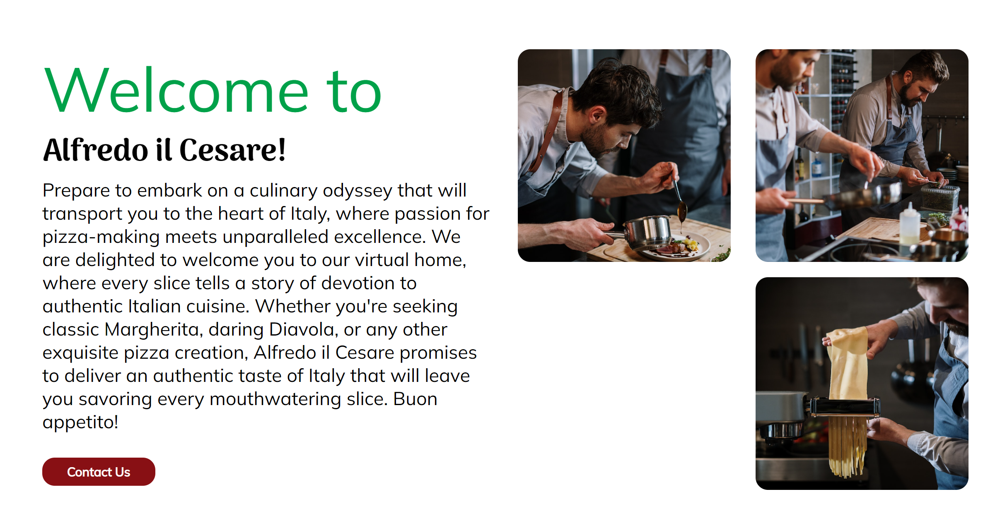
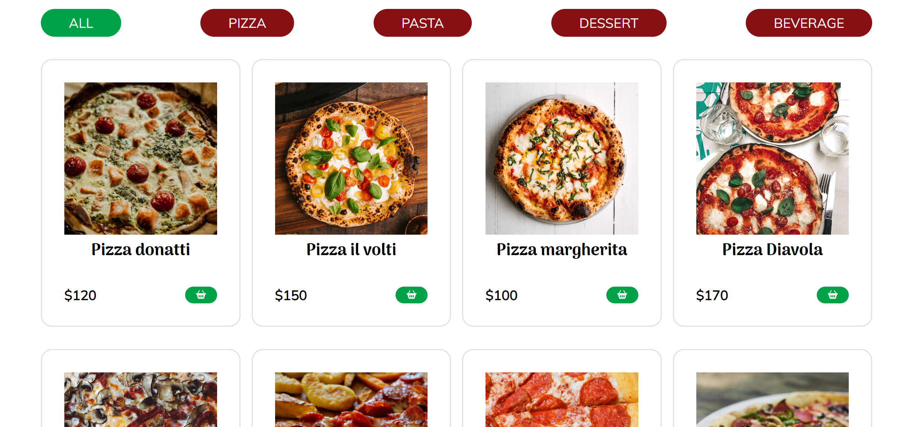
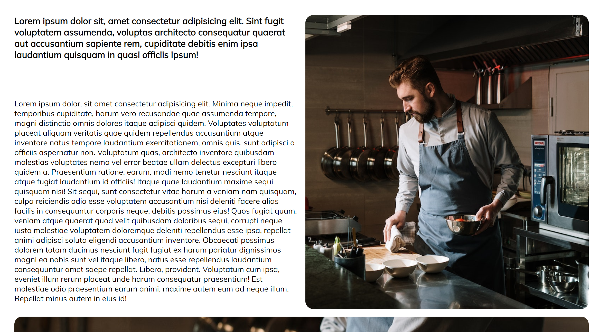

<h1>Alfredo-il-Cesare</h1>

Welcome to the Alfredo il Cesare E-commerce Website! This project was created to simulate an online platform for an Italian restaurant, allowing customers to conveniently explore and order delicious Italian dishes from the comfort of their homes. By combining my skills in HTML, CSS (including Flexbox and Grid), and JavaScript, I have developed a user-friendly and visually appealing website

## Links

- [Repo](https://github.com/Alobr/alfredo-il-cesare "Repo")

- [Live](https://alfredo-il-cesare.netlify.app/ "Live View")

## Screenshots

## Built With

- JavaScript
- HTML
- CSS

## Author

**Alonso Bracho**

- [Github](https://github.com/Alobr "Github Alonso Bracho")
- [Email](mailto:alonsoae80@gmail.com?subject=Hi "Mail to")
- [LinkedIn](https://www.linkedin.com/in/alobr/ "Connect with me!")

## 🤝 Support

Give a ⭐️ if you like this project!
